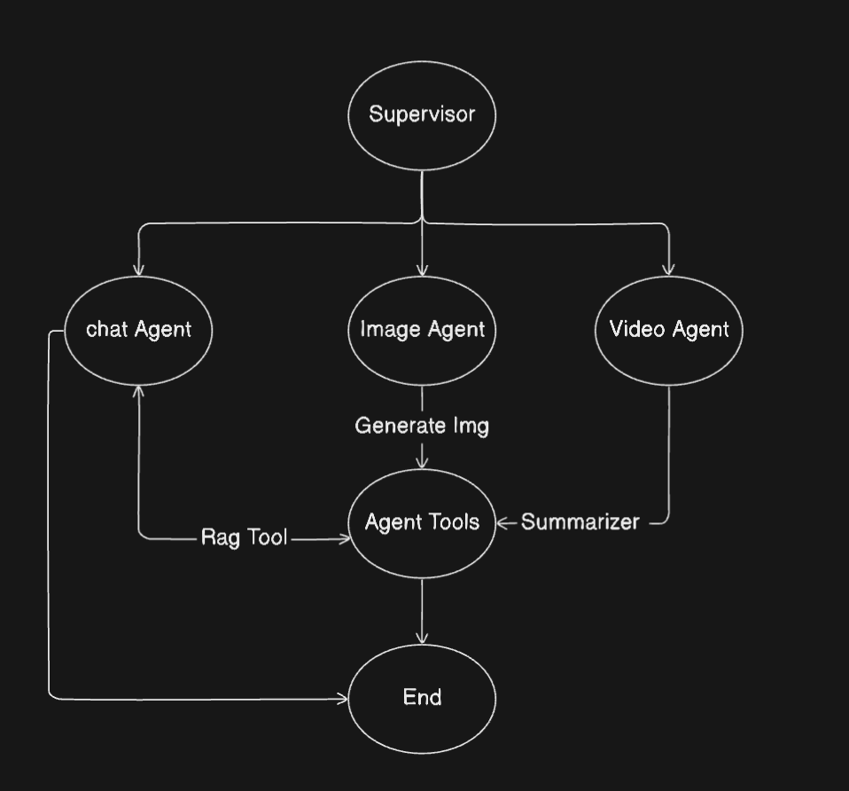
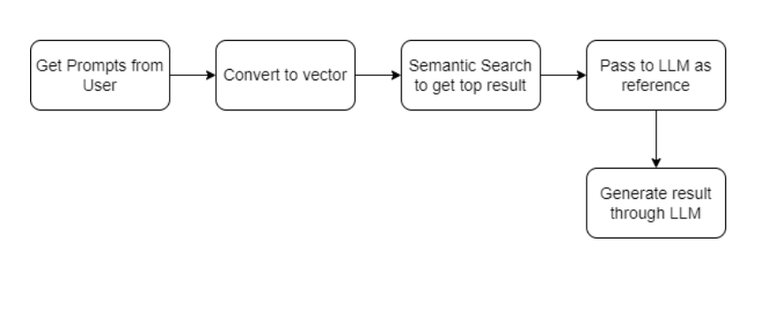
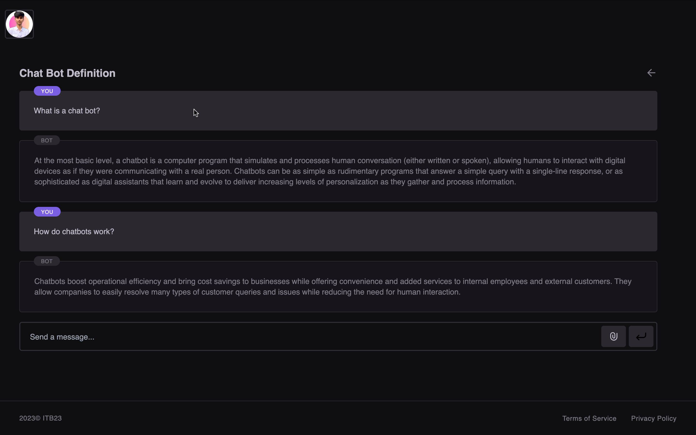
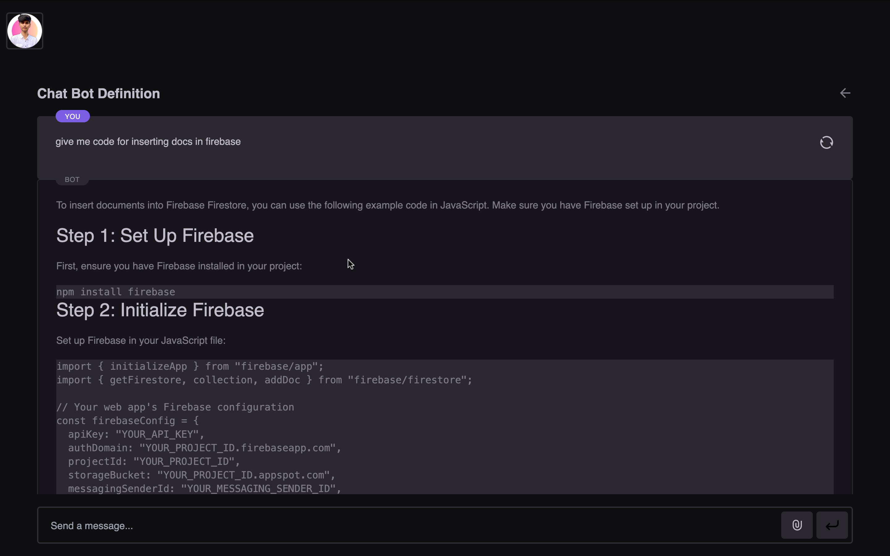
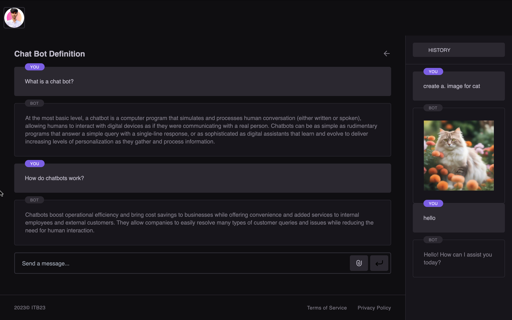
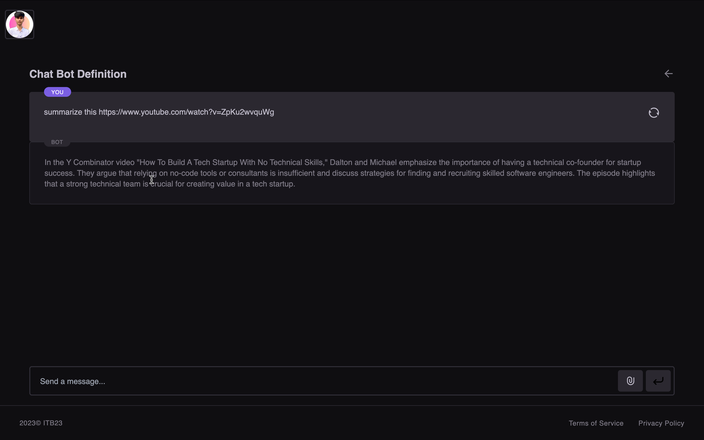
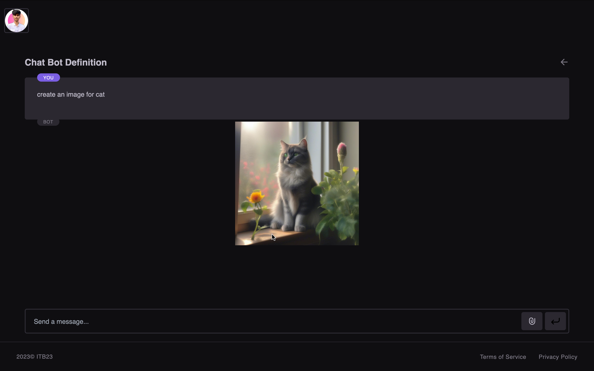
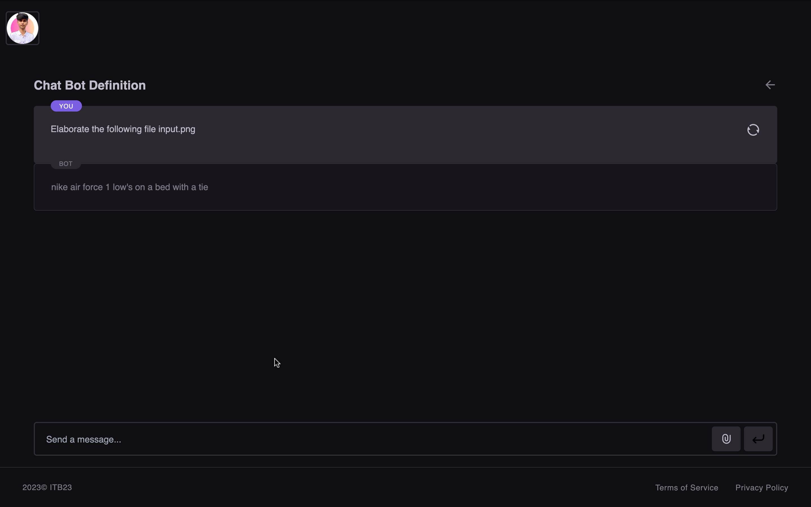

# AI Chat Assistant

## Description

This platform utilizes advanced semantic search algorithms to analyze and retrieve relevant data from this diverse content repository. After processing the input prompt, the system performs a semantic search to fetch pertinent content, which is then used as references for the language model to enhance the accuracy and relevance of its outputs.

The platform is designed to handle inputs across a diverse formats including images, YouTube links, and pdf files. For videos, it fetches metadata through the YouTube API, which is then effectively summarized using a LLM to provide concise and relevant content overviews. Similarly, the system is equipped to summarize content from images, ensuring a comprehensive and versatile user experience that accommodates various types of media.

Additionally, the platform incorporates the capability to generate images using the Stable Diffusion algorithm, further enriching the user interaction experience by providing visual content generation based on textual prompts. The system stores generated images in Pinata (IPFS) and also maintains a comprehensive chat history, enabling seamless continuity in interactions and the ability to reference previous conversations when needed.

## Graph flow

## Technology stack

Tools and technologies that are used in the project.

1. NextJS
2. Langchain
3. LangGraph
4. Pinata
5. Huggingface API
6. Ollama LLM
7. Postgres
8. Firebase

## Project Setup

- For this project, you will need Ollama LLM for langchain to process the textual documents and data of our application same goes for the output obtained and context length of the chat. The steps to do so are:
  > Clone our repository -> npm install command for NextJs frontend node modules
- Run the following commands in the terminals:
  > npm run dev

## Usage

- After setup, you can open the link provided for the localhost port. After that, you reach the login screen.
- You can login using your google account which will read your profile name, email, phone and photo and store them in the database as user data.
- In AI chatbot, you can see the chat window in the user input textarea we have provided the options of uploading image, video and text
- There are limitations of which individual type of respective inputs are accepted in our model

  > For Image : JPG, JPEG, PNG

  > For Video : Youtube video links.

- Also TEXT-TO-IMAGE, just have to choose the option and enter the text in the same textarea and you will get the output in the chat window itself, and you can continue with the chat.

## Flowchart

## Applications

- Content Curation, News Aggregation, Document Review
- Academic Research, Content Extraction
- Educational Learning, Business Intelligence Reports
- Accessibility, Content Generation
- Visual Search, Tourism & Navigation
- Media & Entertainment, Interview Analysis
- Healthcare Services & Professionals

## Screenshots

